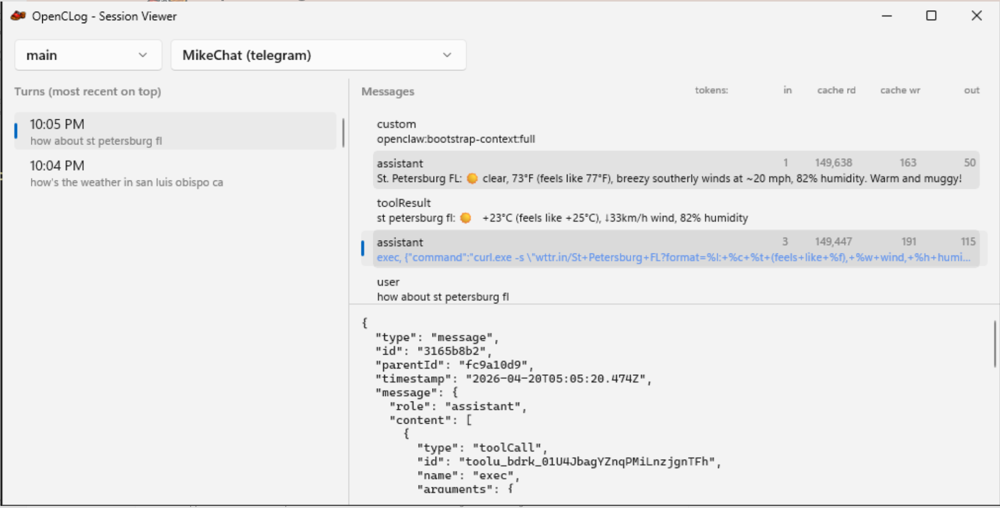

# open-clog

A Windows desktop app for viewing and analyzing Open Claw session logs

## Example

## Install

(On a Windows device with Open Claw installed)

Microsoft Store:  
https://apps.microsoft.com/detail/9NDG8W27GRMZ?hl=en-us&gl=DE&ocid=pdpshare

WinGet:  
`winget install "Open CLog" --source msstore`  
`start OpenCLog`

## Projects

- **open-clog** — WinUI 3 desktop application
- **open-clog.Core** — Core library (session log parsing)
- **open-clog.Tests** — Unit tests

